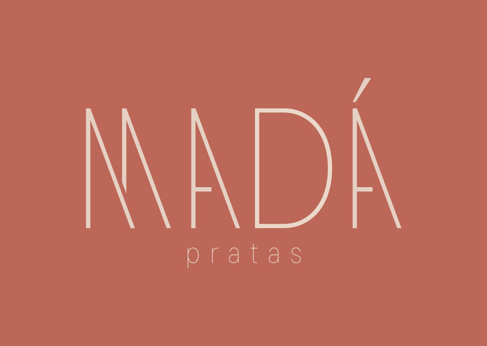

# <h1 align="center"> ✨ Use Mada </h1>

Projeto desenvolvido para a <strong>Mada Pratas</strong>, uma marca de joias em Prata 925.
O objetivo foi criar uma página estilo <strong>Linktree</strong>, reunindo os principais canais da marca de forma elegante, responsiva e intuitiva, proporcionando uma experiência simples para quem deseja conhecer a coleção ou entrar em contato pelo WhatsApp.

  <a href="#-tecnologias">Tecnologias</a>&nbsp;&nbsp;&nbsp;|&nbsp;&nbsp;&nbsp;
  <a href="#-projeto">Projeto</a>&nbsp;&nbsp;&nbsp;|&nbsp;&nbsp;&nbsp;
  <a href="#-funcionalidades">Funcionalidades</a>&nbsp;&nbsp;&nbsp;|&nbsp;&nbsp;&nbsp;
  <a href="#-layout">Layout</a>

  

---

## 🚀 Tecnologias

Esse projeto foi desenvolvido utilizando:

* HTML5
* CSS3
* JavaScript
* Git e GitHub
* Figma

---

## 💻 Projeto

O **Use Mada** é uma landing page inspirada no conceito de Linktree, criada para centralizar os principais canais da marca em um único lugar.

O projeto foi pensado para transmitir a identidade visual da Mada por meio de uma interface minimalista, elegante e responsiva, facilitando o acesso ao site oficial e ao atendimento personalizado via WhatsApp.

Além da experiência do usuário, este projeto também representa minha evolução prática no desenvolvimento Front-end, aplicando conceitos de estrutura HTML, estilização com CSS e organização de componentes para um projeto real.

---

## ✨ Funcionalidades

* Página totalmente responsiva
* Links rápidos para os principais canais da marca
* Botão de compra direcionando para o site oficial
* Atendimento personalizado via WhatsApp com mensagem automática
* Ícones das redes sociais utilizando Ionicons
* Estrutura simples e de fácil manutenção
* Interface inspirada na identidade visual da marca

---

## 🔖 Layout

Você pode visualizar o projeto através do GitHub Pages:

**https://SEU-USUARIO.github.io/usemada/**

ou acessar o site oficial da marca:

**https://usemada.com/**

---

## 📚 Aprendizados

Durante este projeto pratiquei conceitos importantes como:

* Estruturação semântica em HTML
* Organização de componentes
* Estilização com CSS
* Responsividade
* Utilização de bibliotecas externas (Ionicons)
* Boas práticas de organização de código
* Publicação de projetos no GitHub

---

Feito com ♥ por **Renata Mayra**

✨ Desenvolvido como projeto de estudo e aplicação prática para uma marca real.
